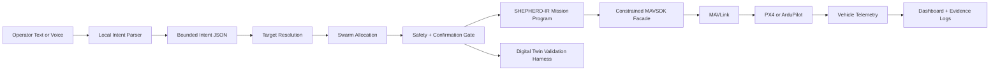

# Shepherd-AI

Offline-first autonomy orchestration for real drone swarms.

Shepherd-AI is a research project for turning natural-language operator intent into typed, reviewable, safety-gated MAVSDK/MAVLink missions for PX4/ArduPilot aircraft. The LLM never flies drones directly. It only proposes structured intent JSON; deterministic backend systems own target resolution, swarm allocation, safety checks, human confirmation, SHEPHERD-IR compilation, and MAVSDK/MAVLink dispatch.

Simulation and PX4 SITL are validation harnesses. The product direction is a local/edge command layer for real MAVLink-connected aircraft.

## Architecture



## Prompt-To-Drone Pipeline

1. The operator types or speaks a mission request.
2. `backend/brain.py` parses the request into structured intent JSON with confidence and confirmation fields.
3. `POST /api/mission/plan` resolves targets, allocates drones on a cloned digital twin, checks safety, and returns a non-mutating plan preview.
4. The operator confirms or cancels the plan.
5. `backend/controller.py` re-applies fleet, battery, collision, GPS, and mesh checks on the real fleet at confirmation time.
6. `backend/mission_program.py` compiles the mission into a `SHEPHERD-IR/2.0` mission bundle with source metadata, constraints, allocation, assurance, and provenance.
7. `backend/action_script.py` generates a disposable validation script through the restricted MAVSDK facade surface and runs static safety checks.
8. With live dispatch enabled, `backend/controller.py` runs live preflight readiness checks before `backend/drone_bridge.py` maps validated mission steps to MAVSDK/MAVLink calls such as `arm`, `takeoff`, `goto_location`, and `return_to_launch`.
9. Without hardware attached, the digital twin can execute the same validated route as a local validation harness.

Example `SHEPHERD-IR` step inside the bundle:

```json
{
  "op": "GOTO",
  "lat": 24.761,
  "lng": 46.6402,
  "altitude_m": 10,
  "transport": "MAVSDK.action.goto_location"
}
```

## Real Drone Link

Any PX4/ArduPilot aircraft exposing MAVLink can be connected through MAVSDK. Typical endpoints:

```text
PX4 SITL:              udp://:14540
Wi-Fi MAVLink:         udp://192.168.x.x:14550
Telemetry radio/USB:   serial:///dev/ttyUSB0:57600
```

Connect a live MAVLink target:

```bash
curl -X POST http://localhost:8000/api/drone/connect \
  -H "Content-Type: application/json" \
  -d '{"drone_id":"alpha-1","address":"udp://:14540"}'

curl -X POST http://localhost:8000/api/live-mode \
  -H "Content-Type: application/json" \
  -d '{"enabled":true}'
```

For the default PX4 SITL validation endpoint, start PX4 separately, then use the dashboard `PX4 SITL` button or call:

```bash
curl -X POST http://localhost:8000/api/drone/sitl/connect \
  -H "Content-Type: application/json" \
  -d '{"drone_id":"alpha-1","address":"udp://:14540","enable_live":true}'
```

The `PX4 SITL` button only connects to an already-running PX4 endpoint. It does not start PX4.

## Mission Planning API

Dashboard commands use the confirmation flow by default:

```bash
curl -X POST http://localhost:8000/api/mission/plan \
  -H "Content-Type: application/json" \
  -d '{"command":"Bring two drones to Al Nada","selected_drones":[]}'

curl -X POST http://localhost:8000/api/mission/confirm \
  -H "Content-Type: application/json" \
  -d '{"plan_id":"plan-from-response"}'

curl -X POST http://localhost:8000/api/mission/cancel \
  -H "Content-Type: application/json" \
  -d '{"plan_id":"plan-from-response"}'
```

The legacy `POST /api/command` path remains for internal scripted checks, but research and field workflows should use plan-first execution.

## Evidence Logs

Every confirmed mission writes a replayable JSON record under `evidence/` by default. The record includes:

- `SHEPHERD-IR/2.0` mission bundles and mission digests.
- HMAC signatures for the mission bundle digest and the evidence record digest.
- Parser/model provenance and bounded intent JSON.
- Target resolution, selected drones, safety reports, preflight results, execution results, and confirmation state.
- Fleet snapshot at confirmation time for deterministic replay.
- Report-only runtime assurance events and summaries for monitor findings.
- Action-script sandbox summaries without treating the generated script as an authority path.

Use `SHEPHERD_EVIDENCE_DIR` to write records somewhere else. Set `SHEPHERD_SIGNING_KEY` or `SHEPHERD_SIGNING_KEY_FILE` to keep a stable signing key across machines; otherwise Shepherd-AI creates a local ignored key at `.shepherd/signing.key`.
See `examples/sanitized_evidence_structure.json` for the evidence shape. It is a structural example only and is not trusted signed evidence.

```bash
curl http://localhost:8000/api/evidence
curl http://localhost:8000/api/evidence/evidence-id-from-confirm-response
curl http://localhost:8000/api/evidence/evidence-id-from-confirm-response/verify
curl http://localhost:8000/api/evidence/evidence-id-from-confirm-response/replay
.\.venv\Scripts\python.exe -m backend.evidence_replay evidence-id-from-confirm-response
```

Run signed evidence records as a backend regression suite:

```powershell
.\.venv\Scripts\python.exe -m backend.scenario_regression
curl http://localhost:8000/api/research/scenario-regression
```

Use a generated manifest as a release gate when expected off-nominal failures should be distinguished from unexpected regressions:

```powershell
.\.venv\Scripts\python.exe -m backend.scenario_regression --manifest .tmp_scenarios\scenario-manifest.json --report .tmp_scenarios\regression-report.json
curl "http://localhost:8000/api/research/scenario-regression?include_cases=false"
```

Manifest-aware regression exits successfully only when each scenario matches its expected pass/fail result, failure reasons, and assurance monitor expectations.

Generate a report-only runtime assurance summary from signed evidence:

```powershell
.\.venv\Scripts\python.exe -m backend.assurance_report --report .tmp_scenarios\assurance-report.json
curl "http://localhost:8000/api/research/assurance-report?include_records=false"
```

The assurance report reads existing evidence records and summarizes monitor findings, replay status, signatures, selected vehicles, and fallback recommendations. It does not call MAVSDK or trigger automatic vehicle behavior.

Generate ignored off-nominal scenario records for local regression work:

```powershell
.\.venv\Scripts\python.exe -m backend.scenario_fixtures --output .tmp_scenarios
```

The generated manifest includes nominal, tampered, safety-rejected, selected-drone mismatch, low-battery, live-link, altitude-envelope, and operator-relative cases. These records are development fixtures and should stay out of git.

Validate or export the early bilingual mission-command dataset for future parser training:

```powershell
.\.venv\Scripts\python.exe -m backend.mission_dataset validate
.\.venv\Scripts\python.exe -m backend.mission_dataset export
.\.venv\Scripts\python.exe -m backend.mission_dataset evaluate --summary-only
.\.venv\Scripts\python.exe -m backend.mission_dataset evaluate --path data\mission_commands\benchmark.jsonl --report .tmp_scenarios\parser-eval.json --markdown-report .tmp_scenarios\parser-eval.md
.\.venv\Scripts\python.exe -m backend.mission_dataset evaluate --path data\mission_commands\adversarial_holdout.jsonl --report .tmp_scenarios\adversarial-eval.json --markdown-report .tmp_scenarios\adversarial-eval.md
```

Train and evaluate the first learned-parser research baseline:

```powershell
.\.venv\Scripts\python.exe -m backend.learned_parser train-baseline --output .tmp_models\learned_parser_baseline.json --report .tmp_models\learned_parser_report.json
.\.venv\Scripts\python.exe -m backend.learned_parser evaluate --artifact .tmp_models\learned_parser_baseline.json --summary-only
.\.venv\Scripts\python.exe -m backend.learned_parser predict "Send two drones to KAFD" --artifact .tmp_models\learned_parser_baseline.json
.\.venv\Scripts\python.exe -m backend.parser_promotion --artifact .tmp_models\learned_parser_baseline.json --report .tmp_models\parser_promotion_gate.json --allow-failure
.\.venv\Scripts\python.exe -m backend.parser_promotion --candidate-type transformer-model --model-dir .tmp_models\transformer_parser\model --report .tmp_models\transformer_parser\promotion_gate.json
```

Prepare the optional PyTorch/transformer parser corpus and check training dependencies:

```powershell
.\.venv\Scripts\python.exe -m backend.transformer_parser prepare --output-dir .tmp_models\transformer_parser\corpus
.\.venv\Scripts\python.exe -m backend.transformer_parser status
```

## Quick Start

Additional guides:

- `PX4_SITL_SETUP.md` explains how to start PX4 SITL before connecting Shepherd-AI.
- `LLM_SETUP.md` explains local/remote Ollama-backed parsing and parser status checks.
- `RESEARCH_WALKTHROUGH.md` gives a concise system walkthrough.
- `LEARNED_PARSER.md` explains the training scaffold, frozen splits, and strict bounded-intent adapter.

### One Command

```bash
npm run dev
```

This starts the FastAPI backend on `http://localhost:8000` and the Vite frontend on `http://localhost:5173`.

### Backend

Use the project virtual environment for backend commands:

```powershell
cd shepherd-ai
python -m venv .venv
.\.venv\Scripts\activate
pip install -r backend/requirements.txt
python -m uvicorn backend.main:app --port 8000 --reload
```

### Frontend

```bash
cd frontend
npm install
npm run dev
```

Open `http://localhost:5173/` in Chrome for browser voice input support.

## Current Research Surface

- Offline-first text command input with optional local/remote Ollama parser.
- Plan-first mission preview with confirm/cancel before dispatch.
- Operator position/heading link for commands such as `Bring two drones to me`.
- Deterministic target resolution for landmarks, coordinates, operator location, and relative references.
- Fleet assignment, energy checks, altitude deconfliction, GPS-denied test mode, and mesh/link modeling.
- Geometric safety sandbox with Shapely fallback.
- Constrained MAVSDK facade for allowed high-level operations only: `ARM`, `TAKEOFF`, `GOTO`, `HOLD`, `RTL`, `LAND`.
- `SHEPHERD-IR/2.0` mission program panel showing the exact validated command bundle, including constraints, assurance monitors, allocation, and provenance.
- Live preflight readiness gate for connected vehicle, battery reserve, navigation quality, and facade operation whitelist checks.
- Signed confirmed-mission evidence logs for replay, audit, tamper detection, and research evaluation.
- Evidence replay harness that verifies signatures, checks mission digests, re-runs safety validation, and compares recorded mission consistency.
- Scenario regression runner that replays signed evidence records across backend changes and fails on integrity, consistency, or safety regressions.
- Ignored off-nominal scenario fixture generator for local evidence replay coverage.
- Report-only runtime assurance events for battery reserve, altitude envelope, safety replay status, localization confidence, link health, and selected-vehicle consistency.
- Assurance report generator that summarizes signed evidence without dispatch side effects.
- Bilingual mission-command dataset scaffold with seed, 200+ row benchmark, and adversarial holdout files, train/eval/holdout splits, and offline parser evaluation reports.
- Smoke-tested offline parser baseline for the current English/Arabic seed benchmark.
- Learned-parser research scaffold with a nearest-ngram baseline artifact, optional transformer trainer, frozen train/eval/holdout handling, adversarial evaluation, strict bounded-intent adapters, and parser promotion gate for both learned artifacts and trained transformer model directories.
- PX4/ArduPilot MAVSDK bridge with connection diagnostics and live telemetry sync.
- Digital twin validation harness for local development without hardware.

## Verification

```powershell
.\.venv\Scripts\python.exe -m backend.smoke_tests
npm --prefix frontend run lint
npm --prefix frontend run build
```

The Vite build may warn that the MapLibre chunk is larger than 500 KB; that warning is not a build failure.

## Example Commands

```text
deploy 5 drones to scan KAFD
make 3 drones go to kafd and 4 to al nada
spiral into the stadium
send beta-1 to secure the airport
bring two drones to me
recall all drones
```
