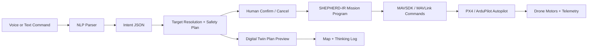

# Shepherd-AI (Al-Ra'i)

Bridging the gap between strategic human intent and multi-agent execution.

## Architecture



## Prompt To Drone

Judges should see this as a compiler pipeline, not magic:

1. The commander speaks or types natural language.
2. `backend/brain.py` parses it into structured intent JSON.
3. `POST /api/mission/plan` resolves targets, allocates drones on a cloned digital twin, checks safety, and returns a plan preview without moving drones.
4. The operator confirms or cancels the plan from the dashboard.
5. `backend/controller.py` applies battery, collision, GPS, and mesh safety checks on the real fleet at confirmation time.
6. `backend/mission_program.py` compiles the mission into `SHEPHERD-IR/1.0`, a drone-readable step program.
7. `backend/action_script.py` synthesizes a temporary Python action script through a restricted MAVSDK facade and validates it in a sandbox/static safety pass.
8. In simulation mode, the digital twin executes the same validated route visually.
9. In live mode, `backend/drone_bridge.py` maps the validated mission steps to MAVSDK/MAVLink calls like `arm`, `takeoff`, `goto_location`, and `return_to_launch`.

Example `SHEPHERD-IR` step:

```json
{
  "op": "GOTO",
  "lat": 24.761,
  "lng": 46.6402,
  "altitude_m": 10,
  "transport": "MAVSDK.action.goto_location"
}
```

The dashboard Plan Preview panel shows the pre-dispatch target marker, selected drones, safety result, and estimated execution mode. The `Program` tab shows both the compiled `SHEPHERD-IR` and the generated disposable Python action script. The OODA overlay shows how synthetic sensor feedback can trigger a route recompile around an obstacle.

To connect a real PX4 SITL or MAVLink-capable drone:

```bash
curl -X POST http://localhost:8000/api/drone/connect \
  -H "Content-Type: application/json" \
  -d '{"drone_id":"alpha-1","address":"udp://:14540"}'

curl -X POST http://localhost:8000/api/live-mode \
  -H "Content-Type: application/json" \
  -d '{"enabled":true}'
```

For the default PX4 SITL UDP endpoint, use the dashboard `PX4 SITL` button or call:

```bash
curl -X POST http://localhost:8000/api/drone/sitl/connect \
  -H "Content-Type: application/json" \
  -d '{"drone_id":"alpha-1","address":"udp://:14540","enable_live":true}'
```

When live mode is enabled, Shepherd-AI still compiles the mission through `SHEPHERD-IR` and the safety sandbox first. Connected drones then receive commands through the constrained MAVSDK facade, and MAVSDK telemetry updates the dashboard instead of simulated map movement.

## Mission Planning API

Dashboard commands use the confirmation flow by default:

```bash
curl -X POST http://localhost:8000/api/mission/plan \
  -H "Content-Type: application/json" \
  -d '{"command":"Bring two drones to Al Nada","selected_drones":[]}'

curl -X POST http://localhost:8000/api/mission/confirm \
  -H "Content-Type: application/json" \
  -d '{"plan_id":"plan-from-response"}'

curl -X POST http://localhost:8000/api/mission/cancel \
  -H "Content-Type: application/json" \
  -d '{"plan_id":"plan-from-response"}'
```

The legacy `POST /api/command` path still exists for scripted demos and tests, but the judge-facing UI is plan-first.

## Quick Start

Additional guides:

- `PX4_SITL_SETUP.md` explains how to start PX4 SITL before clicking the dashboard `PX4 SITL` button.
- `LLM_SETUP.md` explains how to enable Ollama-backed parsing and how to verify parser mode.
- `JUDGE_DEMO.md` gives a concise judge presentation flow.

### One Command

```bash
npm run dev
```

This starts the FastAPI backend on `http://localhost:8000` and the Vite frontend on `http://localhost:5173`.

### Backend

```powershell
cd shepherd-ai
python -m venv .venv
.\.venv\Scripts\activate
pip install -r backend/requirements.txt
python -m uvicorn backend.main:app --port 8000 --reload
```

### Frontend

```bash
cd frontend
npm install
npm run dev
```

Open `http://localhost:5173/` in Chrome for voice input support.

## Features

- Natural language command input in English and Arabic.
- Plan-first mission preview with confirm/cancel before dispatch.
- Voice input using the Web Speech API with EN/AR mode toggle.
- 13-drone fleet across Alpha, Beta, Gamma, and Delta squadrons.
- AI thinking log for transparent allocation decisions.
- Dynamic re-tasking on drone failure.
- Live Riyadh temperature sync plus thermal throttling simulation for high-temperature Saudi conditions.
- Search patterns: perimeter, lawn-mower, and spiral.
- Compound commands, e.g. `make 3 drones go to kafd and 4 to al nada`.
- Flight path lines, waypoint paths, target zones, and drone trails on the map.
- 3D map building extrusions at close zoom levels.
- GPS-denied navigation confidence, drift, hold, and autonomous RTB behavior.
- Mesh routing simulation, collision avoidance, altitude deconfliction, and battery-aware energy checks.
- Optional MAVSDK bridge scaffolding for PX4/ArduPilot SITL or real autopilots.
- SHEPHERD-IR mission program panel showing exactly what commands are sent to drones.
- Real-Time Mission Synthesis panel showing temporary Python action scripts, sandbox results, and OODA reroutes.
- Temperature slider, squadron selection, and mission manifest export.
- GPS-denied fallback simulation with dead-reckoning status banner.
- Demo Mode scripted showcase for live presentations.

## Tech Stack

- Backend: Python 3.12, FastAPI, optional Ollama local LLM.
- Frontend: React 19, Vite, MapLibre GL, shadcn-style UI primitives.
- NLP: local Ollama (`llama3.1:8b` recommended, `gemma2:2b` low-resource option), deterministic heuristic fallback otherwise.
- Drone I/O: optional MAVSDK bridge, disabled by default in simulation mode.

## Demo Commands

```text
deploy 5 drones to scan KAFD
make 3 drones go to kafd and 4 to al nada
spiral into the stadium
send beta-1 to secure the airport
recall all drones
أرسل ٥ طائرات إلى المطار
```
