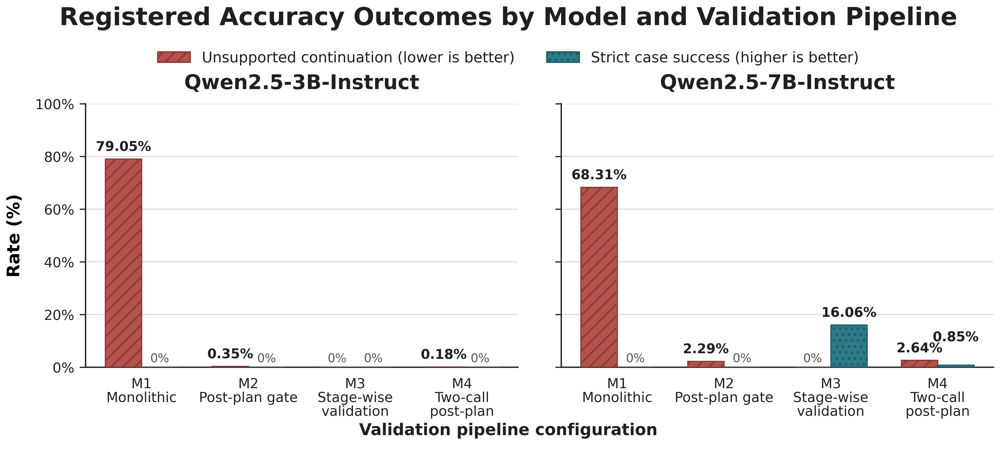

# Validation Placement in Static Multi-UAV Language Planning

Reproducibility repository for the paper **"Validation Placement in Static
Multi-UAV Language Planning: A Paired Failure-Containment and Compute Study."**

The study tests whether moving validation before, during, or after language-model
planning changes unsupported continuation, static plan fidelity, and inference
cost. It uses 284 held-out MultiUAV-Plat source-task clusters, five paired
evidence conditions, four planner configurations (M1-M4), and immutable
Qwen2.5-3B-Instruct and Qwen2.5-7B-Instruct revisions.



## Main Result

Stage-wise validation (M3) contained every registered non-executable case for
both model sizes. With Qwen2.5-7B, it also reached 16.1% strict static plan
fidelity on executable cases. The 3B model reached zero static plan fidelity for
all methods. These are static benchmark results, not simulator execution,
physical flight, or a general safety guarantee.

M4 is **model-call-count-matched** to M3. It is not matched for latency, tokens,
memory, or energy.

## Repository Layout

| Path | Contents |
| --- | --- |
| `paper/` | Final IEEE LaTeX source, PDF, figures, figure data, and build script |
| `datasets/multiuav_plat/` | Frozen source audit, split, interventions, labels, run configurations, and admission records |
| `src/shepherd_ai/multiuav_*.py` | M1-M4 orchestration, strict parsing, validators, checkpointing, scoring, and analysis |
| `scripts/*multiuav*.py` | Dataset, inference, admission, scoring, analysis, and audit entry points |
| `outputs/` | Promoted machine-readable results and provenance manifests |
| `reports/` | Human-readable analyses, failure summaries, tables, and figures |
| `docs/` | Frozen study protocols, model revisions, execution scope, and exact commands |
| `infra/nautilus/` | Kubernetes manifests used for the GPU runs |
| `tests/` | Focused tests for the publication pipeline |
| `presentation/` | Final research presentation and preview montage |

The complete pre-split Shepherd-AI development tree remains available through
the `archive/full-shepherd-ai-history` tag. The Grounded Before Flight ISEF
continuation workspace is in
[`shepherd-ai-isef`](https://github.com/cyberuniversal/shepherd-ai-isef).

## Setup

```powershell
python -m venv .venv
.\.venv\Scripts\Activate.ps1
python -m pip install --upgrade pip
python -m pip install -r requirements.txt
```

The analysis and audit path runs without loading either language model. GPU
inference requires the optional pinned-model environment and the external model
weights described in `docs/multiuav_model_revisions.md`.

## Verify

```powershell
python -m pytest -q
python -m ruff check src scripts tests paper/build_resource_figure.py
```

Exact reconstruction, inference, admission, analysis, and manuscript commands
are documented in [`docs/final_reproduction_commands.md`](docs/final_reproduction_commands.md).

Build the submitted manuscript with an IEEEtran-capable TeX distribution:

```powershell
Set-Location paper
python build_resource_figure.py
pdflatex -interaction=nonstopmode -halt-on-error main.tex
pdflatex -interaction=nonstopmode -halt-on-error main.tex
```

## Scope

Whisper, DistilBERT, vision, and physical or official-simulator execution are
not integrated into the final M1-M4 experiment and are not claimed as final
system components in this repository. Failed attempts and negative results are
retained where required by the frozen research-integrity workflow.

## Citation

Use [`CITATION.cff`](CITATION.cff), or cite the paper as:

```bibtex
@inproceedings{alnuwaiser2026validation,
  author = {Mohammed Alnuwaiser and Aishwarya Tomar},
  title = {Validation Placement in Static Multi-UAV Language Planning: A Paired Failure-Containment and Compute Study},
  year = {2026},
  note = {Submitted manuscript}
}
```

No DOI or acceptance status is claimed.

