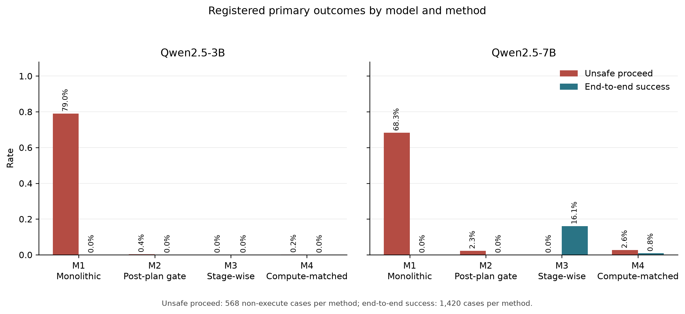
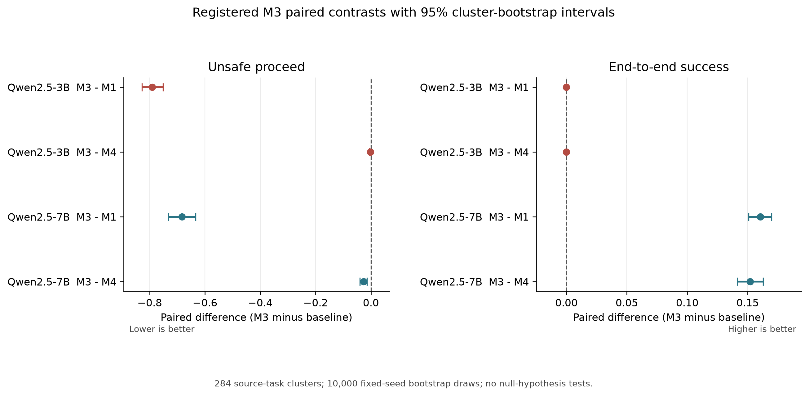
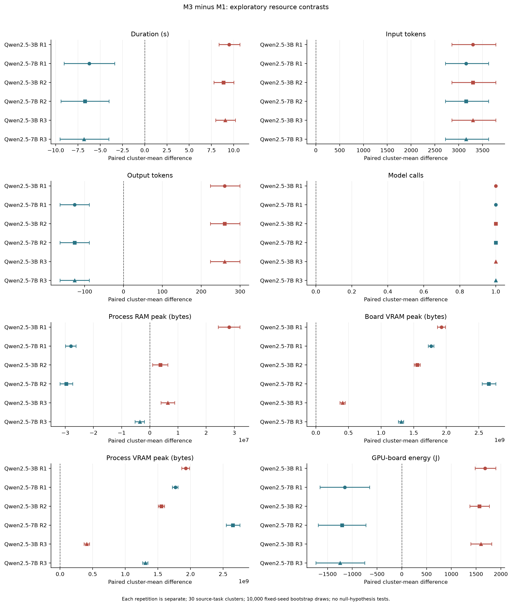
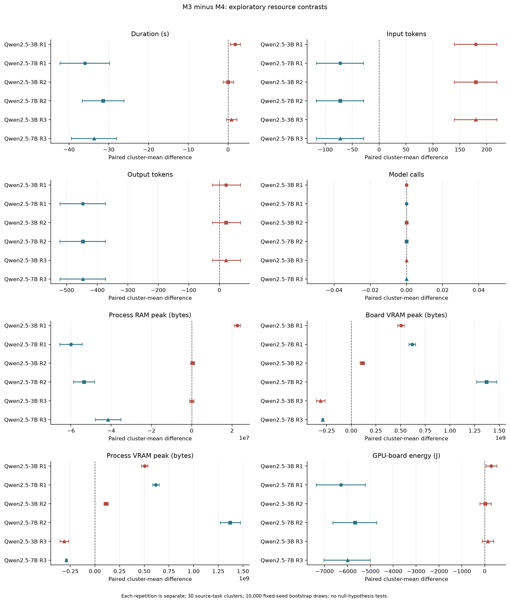

# MultiUAV Manuscript External Review Packet

**Status:** ready for external review; no external review has been received.

Do not mark this packet as reviewed, approved, or externally validated until a real reviewer returns a response that satisfies the protocol.

The hashes below bind this packet to the exact manuscript and aggregate evidence artifacts. A changed manuscript requires a newly generated packet and a new review round. Text hashes use UTF-8 bytes with a single LF newline convention; binary hashes use raw bytes.

## Artifact bindings

| Artifact | Path | SHA-256 |
|---|---|---|
| `accuracy_contrast_figure` | `reports/figures/multiuav_accuracy_registered_contrasts_v1.png` | `c3f547a7b35d33d286ad7b34e1cfa8affb69d6b6ac26ea3d841d4b5392ccf35b` |
| `accuracy_contrast_table` | `outputs/tables/multiuav_accuracy_registered_contrasts_v1.csv` | `66e543328cba2f1e259ecb9e4df872ea0c80b17cd08b2fe55c3b368e60bdf5c3` |
| `accuracy_figure_manifest` | `outputs/evaluations/multiuav_accuracy_figures_v1/manifest.json` | `6089a24f0f38107fc7d8f01ee733972ed4a92be913f565926812cb7288a53dec` |
| `accuracy_primary_figure` | `reports/figures/multiuav_accuracy_primary_outcomes_v1.png` | `c1f4868f4b1bed336b8ee1e7c07a717d5b7161b3bb752c37a31042042c481f4b` |
| `bibliography` | `reports/week9_bibliography.md` | `4bc610b02cdf0bb65da0af47622dbefb446c3c95ae2c69ffdd5b794cc969ffff` |
| `external_review_protocol` | `docs/multiuav_external_review_protocol.md` | `2871936cd3ef9e76c1618b78ab54f9c6b19438a1fb3b1e265637a19f07840985` |
| `internal_traceability_audit` | `outputs/evaluations/multiuav_manuscript_traceability_v1.json` | `5c6a0efb366b67ea652c85e3e40fd139b75bed3c428c0ad6225fb0199e8c3f8f` |
| `manuscript` | `reports/multiuav_validation_placement_manuscript_v1.md` | `98fb23b121c40ae43ee47a493c96325413ce9f139b3d072b9f67804d969362d4` |
| `resource_contrast_table` | `outputs/tables/multiuav_resource_contrasts_v1.csv` | `ab4030fab0e09103ad31768493be2911ae7df6938dea5e72636f6fc5bb2a767d` |
| `resource_matched_figure` | `reports/figures/multiuav_resource_m3_minus_m4_v1.png` | `563ee848b594cbe10679bc7ff718198b5f49b8d77da6e19a4489bab3604387af` |
| `resource_primary_figure` | `reports/figures/multiuav_resource_m3_minus_m1_v1.png` | `e2580451451b2dc3f331c08fd988419968597f871fb4380041e51ca26e7aaaf0` |
| `resource_reporting_manifest` | `outputs/evaluations/multiuav_resource_reporting_v1/manifest.json` | `066a9e8ef322a390017ddc71e6a5d7a0d3cc5b1c596c0b5a46a06cbd3a91864e` |

## Review protocol

## Purpose

The active MultiUAV validation-placement study has passed its internal
artifact and claim-boundary audit. External review is required to challenge
the scientific framing, methods, statistics, interpretation, and related-work
positioning. It must not be replaced by an automated approval or a fabricated
reviewer identity.

## Review Artifact

The review target is
`reports/multiuav_validation_placement_manuscript_v1.md`. The packet generator
binds the exact manuscript, internal traceability audit, source tables, and
figure manifests by SHA-256. A changed manuscript requires a new packet and a
new review round.

## Reviewer Requirements

The reviewer should have relevant experience in at least one of robotics,
multi-agent systems, language-model evaluation, experimental design, or
statistical analysis. The project records a pseudonymous reviewer identifier,
declared expertise, and conflict statement. A name, degree, affiliation, or
independence claim must not be invented.

The reviewer is not asked to approve individual benchmark labels. This review
concerns the paper-level argument and whether the evidence supports it.

## Required Questions

1. Is the stated contribution bounded and distinguishable from the cited
   systems without claiming that validation or refusal is individually new?
2. Are M1-M4 described accurately, especially the limit that M4 is matched to
   M3 only by model-call count?
3. Are the five paired variants and source-task-cluster statistical unit
   justified and understandable?
4. Are unsafe proceed and strict end-to-end success valid operationalizations
   for the stated research questions?
5. Is the mixed 3B/7B result interpreted without cherry-picking?
6. Are resource outcomes kept secondary, repetition-specific, and
   hardware-scoped?
7. Are interval estimates described without turning them into unregistered
   null-hypothesis tests?
8. Are the static-fidelity, controlled-derivative, within-Qwen, network,
   hardware, and protocol-deviation limitations sufficiently prominent?
9. Does the related-work section omit a close comparison or misstate a cited
   system?
10. What claims, figures, tables, or wording must change before submission?

## Required Response Structure

The reviewer returns a separate UTF-8 Markdown or PDF file containing:

- reviewer pseudonym and expertise;
- conflict-of-interest declaration;
- overall assessment: accept as internally defensible, minor revision, major
  revision, or not supportable from current evidence;
- numbered findings with severity, manuscript section, and rationale;
- required corrections;
- optional improvements; and
- explicit confirmation of whether the abstract and conclusion match the
  reported results.

The project owner preserves the original review, creates a response-to-review
ledger, and links every accepted correction to a commit. Rejected suggestions
remain recorded with a reason. Review completion does not imply venue
acceptance or physical-safety validation.

## Completion Gate

External review passes only after a real response is preserved, all required
findings are resolved or explicitly rebutted, the reviewer packet hash matches
the reviewed manuscript, and a response ledger passes a separate audit.

## Reviewer response fields

- Reviewer pseudonym:
- Relevant expertise:
- Conflict-of-interest declaration:
- Overall assessment:
- Numbered findings with severity, section, and rationale:
- Required corrections:
- Optional improvements:
- Abstract and conclusion match the results (yes/no, with explanation):
- Review date:

## Manuscript under review

# Validation Placement in Local Multi-UAV Language Planning: A Paired Safety-Utility-Compute Study

**Working manuscript draft, 2026-08-11. Not a final submission or an accepted novelty claim.**

## Abstract

Natural-language multi-robot planners can emit plans that are syntactically
valid while advancing on missing, conflicting, or unsupported evidence. This
study evaluates whether the placement of validation within a multi-UAV
planning pipeline changes failure containment, strict task utility, and
inference cost. We construct five matched derivatives of each eligible
MultiUAV-Plat task and compare four configurations: monolithic planning (M1),
deterministic post-plan validation (M2), stage-wise evidence validation (M3),
and a two-call post-plan configuration matched to M3 by model-call budget (M4).
The accuracy evaluation contains 1,420 cases per method for each of two frozen
Qwen2.5 checkpoints. With Qwen2.5-7B, M3 reduced unsafe proceed by
0.6831 relative to M1 and by 0.0264 relative to M4, while improving strict
end-to-end success by 0.1606 and 0.1521, respectively; all four registered 95%
source-cluster bootstrap intervals excluded zero. With Qwen2.5-3B, M3 reduced
unsafe proceed relative to M1, but every method had zero strict end-to-end
success. An RTX 3090 experiment measured 30 source-task clusters in
three repetitions per model-method condition. Results were model dependent:
relative to M1, 3B M3 used more time and
GPU-board energy, whereas 7B M3 used less time and energy despite one
additional model call. Relative to call-count-matched M4, 7B M3 consistently
used fewer tokens, less time, less process RAM, and less GPU-board energy, while
VRAM differences varied by repetition. These results support a bounded
systems-and-measurement contribution: validation placement changed observed
failure containment and resource trade-offs under this static, controlled
benchmark, not physical-drone safety or generality beyond the tested systems.

## 1. Introduction

Language interfaces can reduce the translation burden between an operator's
mission objective and a multi-robot plan. The same interface creates a risk:
a fluent model response can appear executable even when required evidence is
missing, a referenced resource is unavailable, or generated parameters are
unsupported by the visible mission context. In downstream robotic software,
format validity alone is therefore an insufficient success criterion.

Prior systems separate language reasoning from conventional planning,
execution, or monitoring in different ways. TACOS uses coordinator and
supervisor roles for multi-drone tasks [L1]. Swarm-Steward combines
natural-language coordination with deterministic tools and operator-facing
controls [L2]. RoCo, Swarm-GPT, and LLaMAR study multi-robot dialogue, safe
motion planning, and plan-act-correct-verify loops [E1], [E2], [E3]. CommandSwarm and
language-to-PDDL work constrain the representation passed toward execution
[L7], [L8]. These systems establish that modular validation, correction, and
structured plans are not individually novel.

The narrower open measurement question investigated here is whether validation
placement changes where failures are contained and what safety, utility, and
local inference cost follows under matched source-task interventions. The
contribution is the combined experimental design: five paired derivatives per
source task, four validation configurations including a call-count-matched
comparison, explicit containment attribution, and joint accuracy and hardware
measurement under immutable local inference.

## 2. Research Questions

1. How does stage-wise validation change unsafe proceed on registered
   non-executable cases relative to monolithic planning?
2. How does stage-wise validation change strict end-to-end success across all
   five case variants?
3. Does stage-wise validation differ from a two-call post-plan configuration
   when both use the same model-call budget?
4. What latency, token, memory, model-call, and GPU-board-energy trade-offs are
   observed for these configurations on fixed hardware?

## 3. Methods

### 3.1 Source Tasks and Controlled Derivatives

The repository reproduces 75 sessions and 1,500 official MultiUAV-Plat tasks
from the pinned source release. Deterministic eligibility and leakage checks
retain 1,473 source tasks. Each eligible task has five linked variants:
canonical execute, official-alias execute, missing-information clarify,
restored-information execute, and resource-conflict block. The
restored-information variant controls whether a method responds to the
presence of evidence instead of merely recognizing intervention wording.

The primary held-out accuracy manifest contains 284 source-task clusters and
1,420 cases. All variants from a source task remain in one session-level split.
The 30-cluster expert-reviewed pilot is sampled construction quality control;
it is not represented as full row-level human annotation.

### 3.2 Methods and Models

- **M1:** one-call monolithic planner.
- **M2:** one-call planner followed by a deterministic post-plan gate.
- **M3:** evidence ledger and pre-plan validation, followed by planning and
  provenance validation.
- **M4:** two-call post-plan configuration matched to M3 only by model-call
  budget.

The study uses immutable Qwen2.5-3B-Instruct and Qwen2.5-7B-Instruct revisions
under local-only loading and process-level non-loopback socket blocking.
Deterministic decoding permits one locked accuracy matrix per checkpoint. M4
does not match M3 on prompt structure, generated-token count, latency, memory,
or energy; these remain measured outcomes.

### 3.3 Accuracy Outcomes

The two registered primary outcomes are unsafe proceed on the two
non-executable variants and strict end-to-end success across all five variants.
Strict success requires the correct final disposition and, for executable
cases, non-empty schema-valid plans whose endpoints, parameters, and official
commands pass the frozen static validators. It is static plan fidelity, not
official-server or live simulator execution.

The primary contrast is M3 minus M1. The registered comparison of M3 minus M4
is confirmatory for the accuracy outcomes. Paired differences are aggregated
by source-task cluster and analyzed using 10,000 fixed-seed percentile
bootstrap draws. No null-hypothesis tests are used.

### 3.4 Resource Outcomes

The resource campaign uses 30 stratified held-out source-task clusters, all
five variants, two models, four methods, and three repetitions, for 3,600
method-case measurements. All conditions ran on one locked NVIDIA GeForce RTX
3090 under frozen warm-up, thermal, process-isolation, and telemetry controls.
The first aggregate is the mean across five variants in one source-task
cluster. Repetitions are reported separately.

Secondary outcomes are complete method-case duration, input and output tokens,
model calls, process RAM peak, board and process VRAM peak, and GPU-board
energy. Utilization and temperature peaks are diagnostics. Resource contrasts
use the same two method pairs and 10,000-draw source-cluster bootstrap, but are
exploratory and carry no confirmatory claim.

## 4. Results

### 4.1 Accuracy

| Model | Contrast | Unsafe-proceed difference | Strict-success difference |
|---|---|---:|---:|
| Qwen2.5-3B | M3 - M1 | -0.7905 [-0.8275, -0.7518] | 0.0000 [0.0000, 0.0000] |
| Qwen2.5-3B | M3 - M4 | -0.0018 [-0.0053, 0.0000] | 0.0000 [0.0000, 0.0000] |
| Qwen2.5-7B | M3 - M1 | -0.6831 [-0.7324, -0.6338] | 0.1606 [0.1507, 0.1697] |
| Qwen2.5-7B | M3 - M4 | -0.0264 [-0.0405, -0.0141] | 0.1521 [0.1415, 0.1627] |

For Qwen2.5-7B, M3 recorded zero unsafe proceeds in 568 non-executable cases
and 228/1,420 strict successes. M1 recorded 388/568 unsafe proceeds and zero
strict successes; M4 recorded 15/568 unsafe proceeds and 12/1,420 strict
successes. The 3B checkpoint exposes an important negative result: although M3
contained all registered non-executable cases, M1-M4 each achieved zero strict end-to-end success. Refusal or containment alone is therefore not sufficient
for task utility.

### 4.2 Secondary Resource Results

Against M1, 3B M3 added one call, 3,297.68 input tokens, 260.69 output tokens,
8.86-9.49 seconds, and 1,565-1,681 J of GPU-board energy across the three
repetitions; the registered intervals for these differences were entirely
positive. For 7B, M3 also added one call and 3,155.56 input tokens, but produced
125.72 fewer output tokens, took 6.23-6.82 fewer seconds, and used 1,153-1,245 J
less GPU-board energy across repetitions; those duration, output-token, and
energy intervals were entirely negative.

Against call-count-matched M4, model-call difference was exactly zero for both
models. The 3B trade-off was mixed: M3 used 179.62 more input tokens in every
repetition, while duration, RAM, VRAM, output-token, and energy differences
were either small, inconsistent, or had intervals reaching zero outside the
first repetition. For 7B, M3 used 72.17 fewer input tokens, 446.82 fewer output
tokens, 31.41-35.99 fewer seconds, about 41.5-59.9 MB less peak process RAM,
and 5,669-6,279 J less GPU-board energy across repetitions; each corresponding
interval was entirely negative. Board/process VRAM differences changed sign
across repetitions and do not support a stable directional summary.

These interval descriptions are exploratory summaries, not unregistered
significance tests. Exact repetition-specific estimates are preserved in the
resource source table and figures.

## 5. Discussion

The results do not support a simple claim that adding validation always trades
speed for safety. With the 3B checkpoint, stage-wise validation sharply
improved containment relative to M1 but did not recover strict task utility and
increased measured time and energy. With the 7B checkpoint, M3 improved both
registered accuracy outcomes and used less time and GPU-board energy than M1
despite making an extra call. Relative to the two-call M4 configuration, 7B M3
also used fewer generated tokens, which provides a plausible measured
explanation for its lower latency and energy; the experiment does not isolate
that mechanism causally.

The compute-matched result matters because model-call parity did not imply
resource parity. Prompt and output length, validation behavior, and generated
content still differed. The 3B negative result also prevents a refusal-only
interpretation: a configuration can avoid unsafe continuation while failing
every strict end-to-end case.

## 6. Limitations and Research Integrity

- The cases are controlled derivatives of MultiUAV-Plat source tasks, not live
  operator missions.
- Only two scales in one model family are evaluated.
- Plan fidelity is static; no official-server or physical flight execution is
  claimed.
- Network isolation is process-level socket blocking, not an external firewall
  measurement.
- M4 is matched to M3 only by model-call count.
- Resource measurements come from one RTX 3090 campaign. GPU-board energy is not workstation, simulator, network, or UAV energy.
- Peak memory is an observed maximum rather than baseline-subtracted usage.
- A post-admission diagnostic printed one row's request and raw output before
  resource aggregates were inspected. Execution and admission were already
  immutable, and no hidden label or aggregate was exposed. The deviation is
  preserved and disclosed; the study does not claim that no such human
  inspection occurred.

## 7. Conclusion

Under this frozen static benchmark, validation placement changed both failure
containment and compute behavior, but the effect depended strongly on model
scale. Stage-wise validation with Qwen2.5-7B improved unsafe-proceed and strict
success outcomes relative to both monolithic and call-count-matched post-plan
configurations while also reducing several measured resource outcomes. The 3B
configuration improved containment without producing any strict end-to-end
success and carried higher costs relative to M1. The defensible contribution
is therefore a reproducible paired systems-and-measurement protocol and its
mixed empirical result, not a universal claim that stage-wise validation is
safer, cheaper, or sufficient for autonomous deployment.

## References

**[L1]** Alessandro Nazzari, Roberto Rubinacci, and Marco Lovera. "TACOS:
Task Agnostic Coordinator of a Multi-Drone System." *Drones*, volume 10,
article 25, 2026.

**[L2]** Alejandro Jarabo-Penas, Juan Bravo-Arrabal, Edouard G. A. Rolland,
and Anders Lyhne Christensen. "Swarm-Steward: Scalable and Reliable
Natural-Language Coordination of Autonomous Aerial." IEEE conference paper,
2026. Further venue details are not stated in the repository literature
review.

**[L7]** Yaqi Xie, Chen Yu, Tongyao Zhu, Jinbin Bai, Ze Gong, and Harold Soh.
"Translating Natural Language to Planning Goals with Large-Language Models."
arXiv preprint, 2023.

**[L8]** Mohammed Majeed and Amjad Yousef Majid. "CommandSwarm: Safety-Aware
Natural Language-to-Behavior-Tree Generation for Robotic Swarms." arXiv
preprint, 2026.

**[E1]** Mandi Zhao, Shreeya Jain, and Shuran Song. "RoCo: Dialectic
Multi-Robot Collaboration with Large Language Models." arXiv:2307.04738,
2023.

**[E2]** Aoran Jiao, Tanmay P. Patel, Sanjmi Khurana, Anna-Mariya Korol,
Lukas Brunke, Vivek K. Adajania, Utku Culha, Siqi Zhou, and Angela P.
Schoellig. "Swarm-GPT: Combining Large Language Models with Safe Motion
Planning for Robot Choreography Design." arXiv:2312.01059, 2023.

**[E3]** Siddharth Nayak, Adelmo Morrison Orozco, Marina Ten Have, Vittal
Thirumalai, Jackson Zhang, Darren Chen, Aditya Kapoor, Eric Robinson, Karthik
Gopalakrishnan, James Harrison, Brian Ichter, Anuj Mahajan, and Hamsa
Balakrishnan. "LLaMAR: Long-Horizon Planning for Multi-Agent Robots in
Partially Observable Environments." arXiv:2407.10031, 2024.

## Artifact Traceability

- Accuracy report: `reports/multiuav_accuracy_bootstrap_v1.md`
- Accuracy tables: `outputs/tables/multiuav_accuracy_primary_rates_v1.csv` and
  `outputs/tables/multiuav_accuracy_registered_contrasts_v1.csv`
- Resource report: `reports/multiuav_resource_results_v1.md`
- Resource tables: `outputs/tables/multiuav_resource_descriptive_v1.csv` and
  `outputs/tables/multiuav_resource_contrasts_v1.csv`
- Resource analysis record: `docs/multiuav_resource_analysis_protocol.md`
- Working bibliography: `reports/week9_bibliography.md`

Reference metadata is limited to the repository literature review and working
bibliography. Venue-specific formatting remains pending venue choice.
